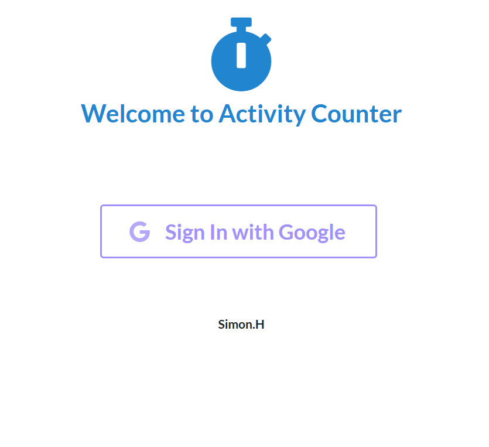
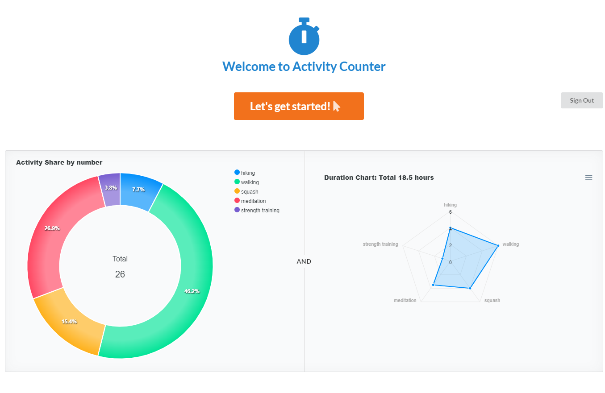

# Activity Counter Project

## Introduction 
Approach(getting 30 days of session info): 

Show overview of session frequency and duration 

Show details of each session(start date, end date, type, etc)

Let user to write their info to the database 
(Activity Goal and Duration Goal : required)

Display differences between actual data and their goal

Give them feedback to push / complement / encourage 
(challenge / adjust)

##  Table of content
- [How to run the application](#how-to-run-the-application)
- [The application](#the-application)
- [Tech stack and frameworks](#tech-stack-and-frameworks)
- [About us](#about-us)

## How to run the application:
- Click on the vercel link: https://activitycounter.vercel.app/
  or
- After cloning the repository, install all the dependencies: npm install
- Be sure that autosurvey-backend is running (see https://github.com/simonhong2022/stepcounter-backend readme)
- Run the application: npm run dev

## The Application

### Landing page / login form:
- When landing on the page, user must sign up:
  
- After signing up the user can sign in

### Welcome page
- In the welcome page:
  - User can create profile with activity goal and duration goal
  

## Tech stack, Frameworks and libriaries
### Tech
  - Java
  - TypeScript
  - PostgreSQL

### Frameworks
  - Spring Boot / Web
  - Next.js 

### Libraries
  - NextAuth 
  - Apex Charts 
  - Semantic UI 

## About us
  - Simon: 
           
  